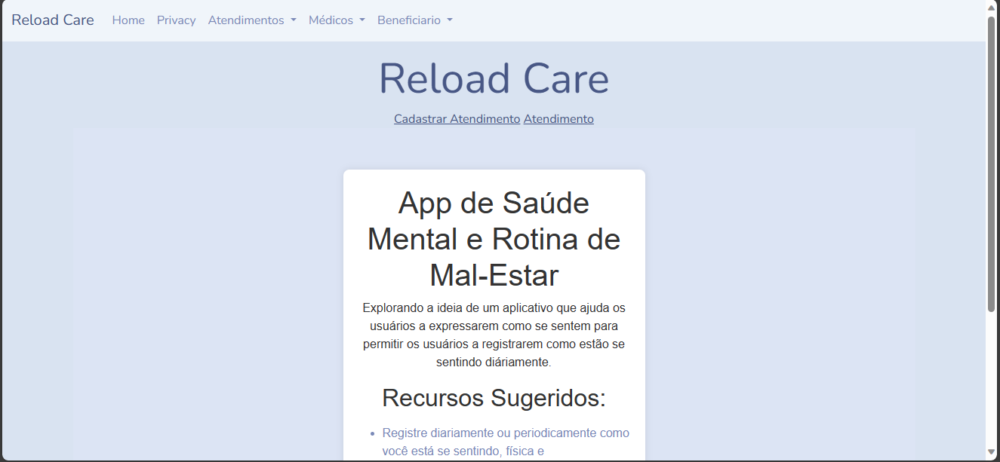

##  Integrantes

Daniel Santos | RM 94265
 
Tarcisio Couto | RM 94717
 
Felipe Jardim | RM 88383
 
João Vitor Santiago de Oliveira Braz | RM 95749
 
Douglas Welber | RM 94269

<h1 align="center"> Reload Care </h1>

 Aplicativo de controle de rotina focado em descobrir oque o beneficiário está sentindo com CRUD ultilizando banco de dados + algumas funcionalidades em .NET MVC 

  

## 🚀 Tecnologias

Esse projeto foi desenvolvido com as seguintes tecnologias:

- C#, .NET
- Entity Framework
- Banco de dados
- Bootstrap 
- Git e Github

## 💻 Projeto
O Projeto é um CRUD com banco de dados focado em registrar oque o usuário está sentindo.

